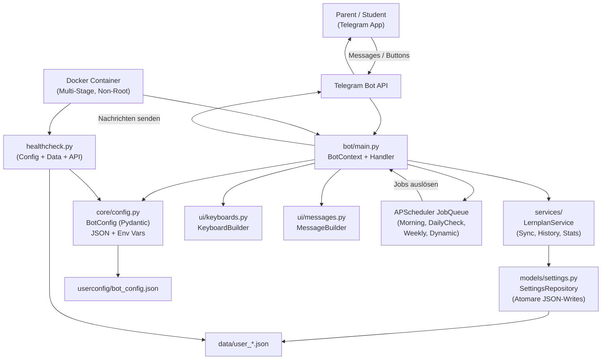
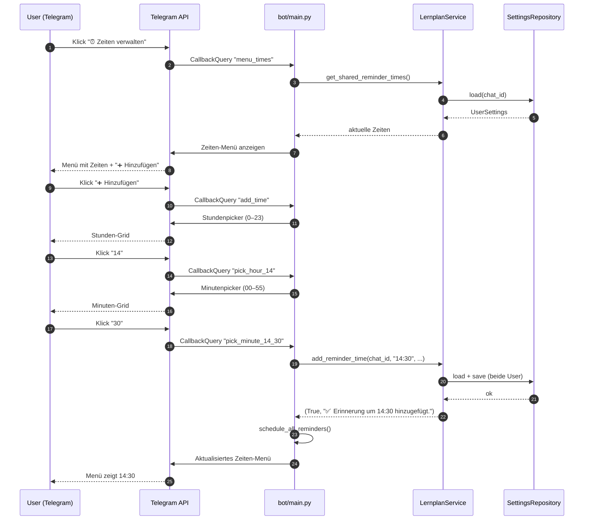
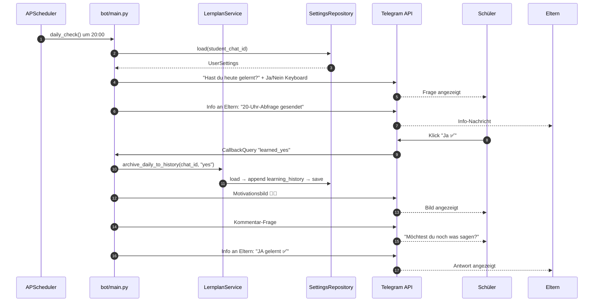

## Architekturübersicht — LernplanReminderBot v2

### Modulstruktur

```
src/
├── bot/
│   └── main.py              # Entrypoint, Handler, BotContext, Scheduler
├── core/
│   ├── config.py            # Pydantic-basierte Konfiguration (JSON + Env)
│   └── logging_config.py    # Logging Setup
├── models/
│   └── settings.py          # UserSettings, DayPlan, SettingsRepository
├── services/
│   └── __init__.py          # LernplanService (Business Logic)
├── ui/
│   ├── keyboards.py         # KeyboardBuilder (alle Telegram-Keyboards)
│   └── messages.py          # MessageBuilder (Textformatierung)
└── healthcheck.py           # Docker HEALTHCHECK Script

tests/
├── test_config.py           # BotConfig Validierung & load_config
├── test_shared_functionality.py  # Service-Layer: Reminder, Sync, History
└── test_weekly_overview_improvements.py  # Messages, Statistik, UI

data/                        # Persistente JSON-Dateien (user_<chat_id>.json)
userconfig/
└── bot_config.json          # Konfiguration (im Container gemountet)
```

---

### Schichtenarchitektur

```
┌─────────────────────────────────────────────────────────┐
│  Telegram API                                           │
└────────┬────────────────────────────────────────────────┘
         │
┌────────▼────────────────────────────────────────────────┐
│  bot/main.py                                            │
│  ┌─────────────┐  ┌───────────────┐  ┌───────────────┐ │
│  │ Handlers    │  │ BotContext    │  │ Scheduler     │ │
│  │ (Commands,  │  │ (Dataclass)  │  │ (APScheduler  │ │
│  │  Callbacks, │  │              │  │  JobQueue)    │ │
│  │  Text/Voice)│  │              │  │              │ │
│  └──────┬──────┘  └──────┬───────┘  └──────────────┘ │
└─────────┼────────────────┼──────────────────────────────┘
          │                │
          │   ┌────────────▼────────────┐
          │   │ BotContext hält:        │
          │   │ • config: BotConfig     │
          │   │ • repo: SettingsRepo    │
          │   │ • service: LernplanSvc  │
          │   │ • keyboards: KBBuilder  │
          │   │ • messages: MsgBuilder  │
          │   └────────────┬────────────┘
          │                │
┌─────────▼────────────────▼──────────────────────────────┐
│  services/__init__.py — LernplanService                 │
│  (Business Logic: Sync, Reminder, History, Statistics)  │
└────────┬────────────────────────────────────────────────┘
         │
┌────────▼────────────────────────────────────────────────┐
│  models/settings.py — SettingsRepository                │
│  (Atomare JSON-Persistenz: tempfile + os.replace)       │
└─────────────────────────────────────────────────────────┘
```

---

### Komponenten-Diagramm (Mermaid)



---

### Sequenzdiagramm — Erinnerungszeit hinzufügen



---

### Sequenzdiagramm — 20-Uhr Tagescheck



---

### Schlüssel-Designentscheidungen

| Entscheidung | Begründung |
| :--- | :--- |
| **BotContext Dataclass** statt globaler Variablen | Testbarkeit, kein verstreuter State, klare Abhängigkeiten |
| **LernplanService** als eigene Schicht | Business Logic von Handler-Code getrennt; testbar ohne Telegram-Mocking |
| **Pydantic BotConfig** mit JSON + Env-Override | Typsichere Validierung, flexible Konfiguration für Docker + lokale Entwicklung |
| **Atomare JSON-Writes** (`tempfile` + `os.replace`) | Kein Datenverlust bei Crash/Stromausfall während des Schreibens |
| **`learning_history`** Feld in UserSettings | Statistik überlebt das tägliche Löschen des `daily_dynamic_plan` |
| **Shared State** zwischen Student + Parent | Erinnerungszeiten und Wochenpläne sind immer synchron |
| **Multi-Stage Docker Build** + Non-Root User | Kleineres Image, Security Best Practice |
| **`zoneinfo`** statt `pytz` | Stdlib ab Python 3.9, kein Extra-Dependency |
| **Grafischer Stunden-/Minutenpicker** | Benutzerfreundlicher als Texteingabe "/addzeit HH:MM" |
