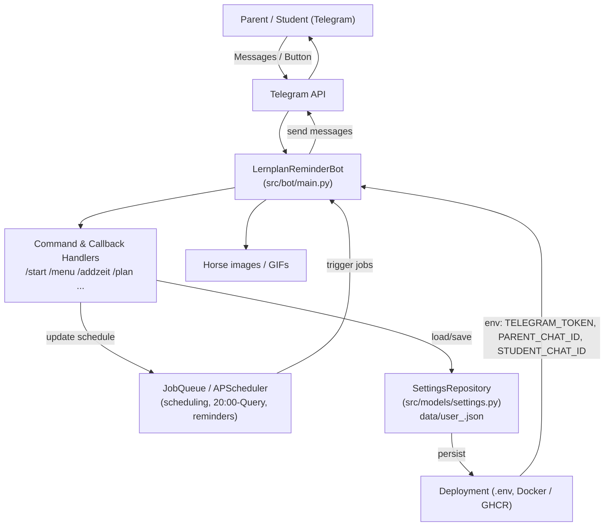
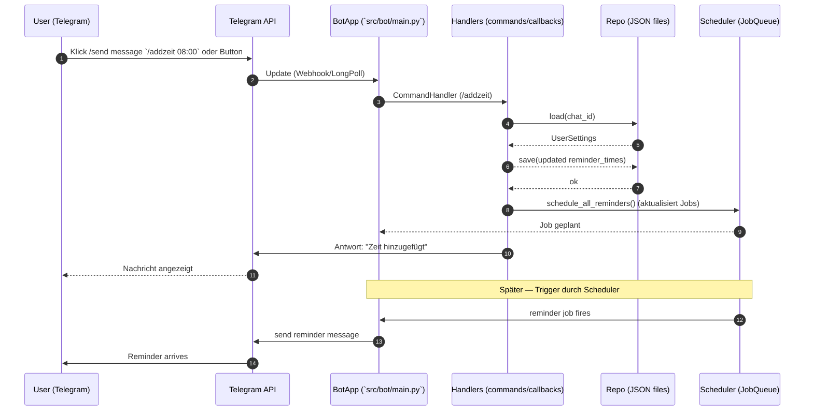

## Architekturübersicht — LernplanReminderBot

Unten sind zwei Darstellungen: ein Komponenten‑Diagramm (Mermaid) und ein Sequenzdiagramm für einen typischen Ablauf.

---

### Komponenten (Mermaid)

---

### Sequenzdiagramm (Mermaid) — Beispiel: Nutzer fügt eine Erinnerungszeit hinzu

---

Kurz (Datei‑/Modulzuordnung)
- `src/bot/main.py` – Bot‑Entrypoint, Handler, UI‑Logik, Message Builder, Scheduler‑Integration
- `src/models/settings.py` – `UserSettings`, `DayPlan`, `SettingsRepository` (JSON‑Persistenz)
- `src/core/logging_config.py` – Logging Setup
- `data/` – Persistente JSON Dateien (`user_<chat_id>.json`)
- `pyproject.toml` – Abhängigkeiten (python-telegram-bot, APScheduler, python-dotenv)

Deployment‑Hinweis
- Konfiguration via `.env` (z. B. `TELEGRAM_TOKEN`, `PARENT_CHAT_ID`, `STUDENT_CHAT_ID`, `DATA_DIR`).
- Docker / docker-compose für Headless Betrieb; mount von `data/` für Persistenz.

---

Wenn du willst, lege ich diese Datei als `ARCHITECTURE.md` ab (erledigt) und kann zusätzlich ein Sequence‑Diagramm für die 20:00‑Abfrage oder das Merge‑/Sync‑Verhalten zwischen Eltern/Schüler erzeugen.
